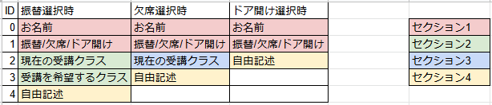

# TransAbsentGAS メンテナンス用文書
## 1. 関数についての説明
**下記以外の関数については中身を書き換えることを想定していない．**
### onFormSubmit(formData)関数
引数`formData`は`FormResponse`クラスの値で，フォーム全体に対する回答が入る．

`itemResponses = formData.response.getItemResponses();`にて，変数`itemResponses`に`ItemResponse[]`クラスの値を取得する（リストになっていることに注意）．
この`itemResponse`クラスには，回答内容を始めとし，質問のタイトルなども含まれており余分な情報が多いため，

```js
for (let i = 0; i < itemResponses.length; i++) {
  responseslist.push(itemResponses[i].getResponse()); // 回答をリストに連結
}
```

変数`responseslist`に情報を整理する．`responseslist`には0から順に回答内容（`string`型）のみが格納されている．
例えば，`responseslist[0]`には回答した「名前」の情報が入っているし，`responseslist[1]`には振替/欠席/ドア開けのいずれかの`string`型の値が入っている．

そのため，`responseslist[1]`の値を用いて，分岐処理を作ることができる．
```js
if (responseslist[1] === "振替") {
  }
// 欠席を選択したとき
else if (responseslist[1] === "欠席") {
  }
// ドア開けを選択したとき
else if (responseslist[1] === "ドア開け") {
  }
// それ以外（未実装）の選択肢を選択したとき
else {
  }
```

この文字列比較処理は，フォームの回答選択肢に依存しているため，フォームを改変する際には右辺の文字列を合わせるようにする．また，振替/欠席の処理においては
```js
notifyToSlack(messtr, getWebHookURLfromClassName(responseslist[2]), true);
```
`notifyToSlack()`関数の第2引数でWebHookURLを取得するために`getWebHookURLfromClassName()`関数を呼び出す際に`responseslist[2]`を用いるため，フォームの回答選択肢に依存する．そのため，シートのクラス識別名と一致するように選択肢を設定する必要がある．


### <font color=red>※最重要注意事項※</font>

Googleフォームの仕様により，**スキップされたセクションの回答内容**は変数`responseslist`には含まれない．

そのため，セクションと質問の配置の仕方によっては分岐時に使用する`responseslist`のインデックス番号がずれる可能性がある．セクションや質問内容を変更する場合には，次の図のように状況を整理することを推奨する．

<center>



</center>

上の例では，`responseslist[0]`及び`responseslist[1]`は全ての選択肢で同じとなるが，自由記述はそれぞれ`responseslist[4]`（振替），`responseslist[3]`（欠席），`responseslist[2]`（ドア開け）に格納されることになる．

---
### getWebHookURLfromClassName(className)関数
引数`className`は`string`型の値で，クラス識別名と照らし合わせて検索を行う．

`const sheet = getWebHookSheet();`の処理により，変数`sheet`にWebHookURLのシートを取得する．エラー時は`null`，そうでないときは`Sheet`情報が入る．

`SpreadsheetApp`を用いてスプレッドシートのデータを使用するとき，
1. スプレッドシート全体（`SpreadSheet`クラス）を取得
2. 特定のシート1枚（`Sheet`クラス）を取得
3. セル（`Range`クラス）にアクセス

という手法を取るのが通例である．参照するシートは，`getWebHookSheet()`関数にて取得する．

`classInfo = sheet.getRange(2, 1, sheet.getLastRow() - 1, 2).getValues()`という処理で，`getRange()`にて指定したセルの範囲から値を読み出す．値は2次元リストとして読み出されて`classInfo`に代入される．これは`2行目1列目`から`値が入力されている最終行-1行`，`2列`分読み出しを行う．言い換えると2行目～値が入力されている最終行，AB列の値を読み出すということである．

```js
for (let i = 0; i < classInfo.length; i++) {
  if (className === classInfo[i][0]) {
    return classInfo[i][1]; // 正常
  }
}
```

`classInfo[i][0]`はA列の値が入っており，クラス識別名が入っている．`classInfo[i][1]`はB列の値が入っており，WebHookURLが入っている．よって，`className`と一致するクラス識別名のWebHookURLを戻り値とする処理になっている．

## 2. 知っておきたいプログラミング知識(JavaScript/GAS)
### 文字列連結編
`string`型における`+`演算子は，文字列の連結を表している．例えば，次の例を考えてみよう．
```js
let a = "Hello,";
let b = "World.";
let c = a + b;
Logger.log(c);
```

ここでは，`a`, `b`, `c`の3つの変数を宣言し，`c`に`a + b`を代入している．ここでcに入っている値は`"Hello,"`と`"World."`を連結した`"Hello,World."`である．  
このように`string`型においては，`+`演算子を用いることで文字列の連結を行うことができる．

---
### 例外対策編
try, catch文を用いることで例外発生時の処理を決めることができる．try, catch文は通常次のように書かれる．
```js
try {
    // 例外が発生する可能性のある処理（主にライブラリ）
} catch (e) {
    // 例外発生時にどのように対応するか
    Logger.log(e);
}
```

この「例外が発生する可能性のある処理」というのは，自分でプログラミングした処理ではなくライブラリに頼っている処理のことである．今回の場合であれば`SpreadsheetApp.openByUrl(spreadSheetURL)`などの処理が該当する．これは`spreadSheetURL`で指定されたGoogleスプレッドシートを開くライブラリ関数であるが，これはGoogleによって提供されている関数であり，自分でプログラミングしたものではない．ライブラリ関数で発生した例外はtry, catch文で対応するのが一般的であり，ここでは`e`に例外情報を代入させている．`Logger.log(e)`とプログラムに書いておけば，例外情報を出力することができる．

---
### JSDocコメント編
JavaScript及びGoogleAppsScriptでは，型の概念が曖昧である．そのため，関数間の値のやり取りが曖昧になる問題がある．JSDocコメントは，関数や変数の宣言の直前に`/** Comment */`を書く記法のことであり，ルールに沿ったコメントを書くことでプログラムの可読性を高めるものである．なお，あくまでコメントでありプログラムとしての意味は全くないものであるため，JSDocコメントを書かなくてもプログラムの動作には影響しない．以下に代表的なJSDocコメントを紹介する．

- @param  
関数の引数を示す@param．関数の引数が何を指すのか明確にする．複数の引数が存在する場合は，引数の個数だけ@paramを順番に記載する．
- @return / @returns  
関数の戻り値を示す@return．@returnsは@returnの別名．関数の戻り値が何を指すのか明確にする．
- @type  
変数の型を示す@type．型はブラケット`{}`のなかに記載する．

下記は，`getWebHookURLfromClassName()`関数のJSDocコメントである．
```js
/**
 * クラス識別名からWebHookURLを取得する関数
 * @param {string} className クラス識別名
 * @returns {string} 正常時string
 * @returns {null} エラー時null
 */
```

JSDocコメントから，この関数は`string`型の引数`className`を取ることが分かる．戻り値は正常時に`string`型の`WebHookURL`が，エラー時は`null`が返されることが分かる．

JSDocに関する詳細は[https://ics.media/entry/6789/](https://ics.media/entry/6789/)を参照すること．

---
### ライブラリ編
Google Apps Scriptにおけるプログラミングでは，Googleが提供する各種`App`を用いることが多い．TransAbsentGASにおいては，`SpreadsheetApp`と`FormApp`を使用している．各クラスの変数に対して，適用できる操作は下記のリファレンスを参照すること．

- SpreadsheetApp  
[https://developers.google.com/apps-script/reference/spreadsheet/spreadsheet-app](https://developers.google.com/apps-script/reference/spreadsheet/spreadsheet-app)
  - Spreadsheetクラス : Googleスプレッドシートファイルにアクセスして変更する  
[https://developers.google.com/apps-script/reference/spreadsheet/spreadsheet](https://developers.google.com/apps-script/reference/spreadsheet/spreadsheet)
  - Sheetクラス : スプレッドシート シートにアクセスして変更する  
[https://developers.google.com/apps-script/reference/spreadsheet/sheet](https://developers.google.com/apps-script/reference/spreadsheet/sheet)
  - Rangeクラス : スプレッドシートの範囲にアクセスして変更する  
[https://developers.google.com/apps-script/reference/spreadsheet/range](https://developers.google.com/apps-script/reference/spreadsheet/range)

- FormApp  
[https://developers.google.com/apps-script/reference/forms/form-app](https://developers.google.com/apps-script/reference/forms/form-app)
  - FormResponse : フォーム全体に対する回答  
[https://developers.google.com/apps-script/reference/forms/form-response](https://developers.google.com/apps-script/reference/forms/form-response)
  - ItemResponse : フォーム内の 1 つの質問項目に対する回答  
[https://developers.google.com/apps-script/reference/forms/item-response](https://developers.google.com/apps-script/reference/forms/item-response)
